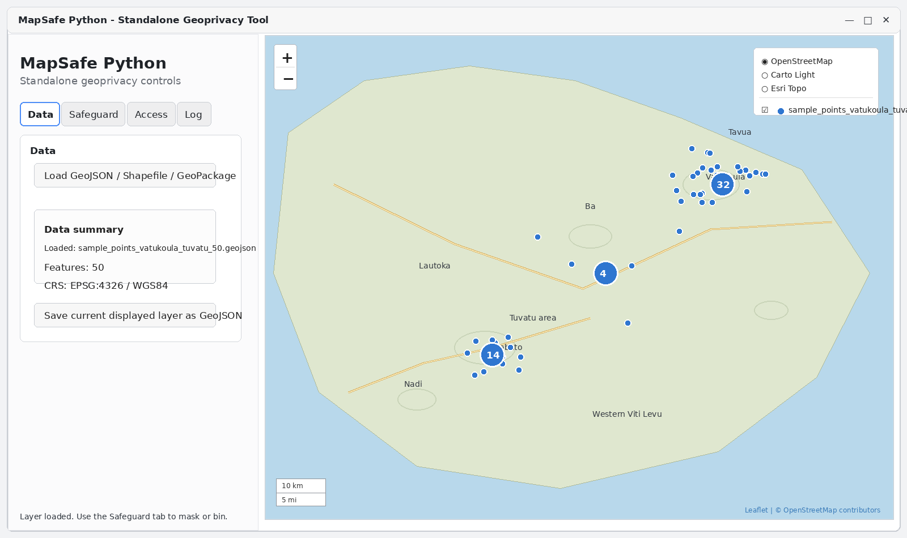
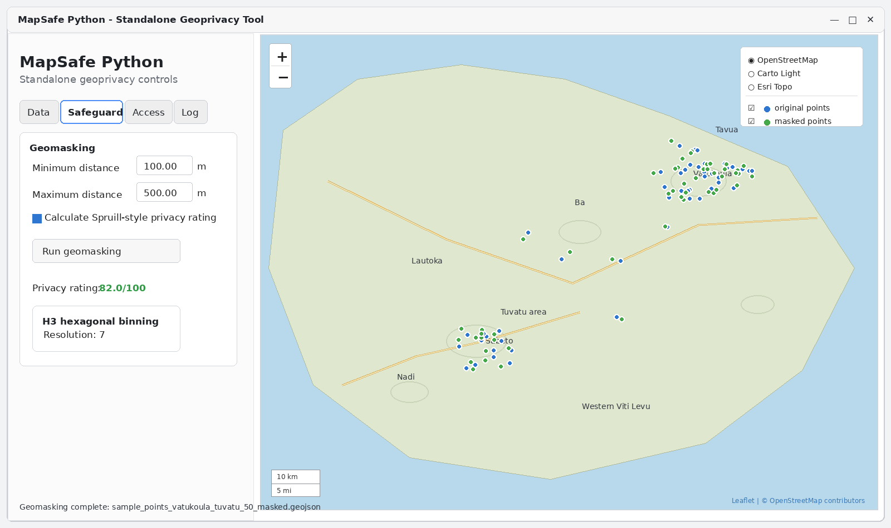
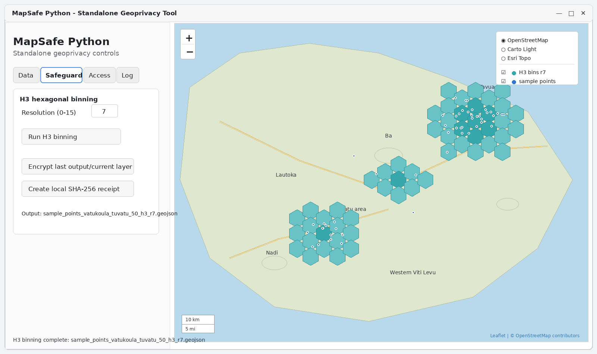
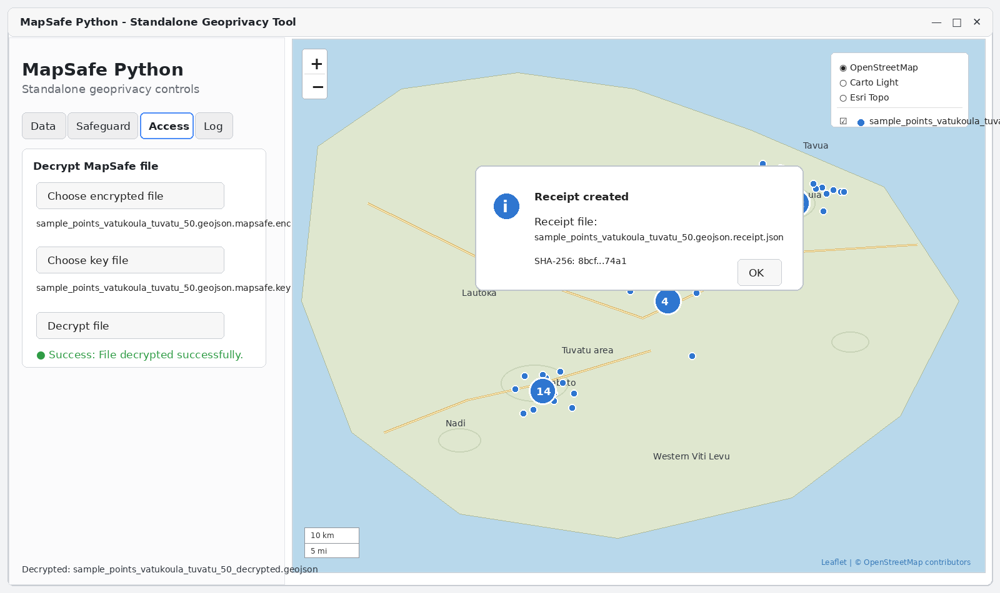

# MapSafe Python

A standalone Python desktop implementation of **MapSafe**, designed to bring the core geoprivacy workflow of the original MapSafe QGIS plugin into a lightweight Python application.

The main design goal is a clear two-panel desktop interface:

- **Left panel**: user controls, parameters, file actions, and status messages.
- **Right panel**: an always-visible interactive map showing the loaded layer and generated outputs.

This standalone version is intended to make MapSafe easier to test, demonstrate, package, and extend outside the QGIS plugin environment.

## Background

This project is a standalone companion to the original MapSafe QGIS plugin:

https://github.com/sharmapn/MapSafe-QGIS-plugin

The QGIS plugin is suitable for users already working inside QGIS. This standalone Python version is useful when the goal is to provide a focused geoprivacy tool without requiring a full GIS platform.


## Purpose

MapSafe Python provides a desktop environment for applying and demonstrating common geoprivacy operations, including:

- geomasking sensitive point data,
- aggregating point data into H3 hexagonal bins,
- encrypting protected outputs,
- creating a local SHA-256 receipt,
- decrypting protected files,
- viewing spatial outputs directly in the application map panel.

## Current UI layout

The application uses a fixed left-right layout.

### Left panel

The left panel contains the workflow controls and is organised into tabs.

#### Data tab

The Data tab is used to:

- load vector spatial data,
- display the loaded file name,
- display feature count,
- display coordinate reference system,
- save the current displayed layer.

#### Safeguard tab

The Safeguard tab is used to:

- run geomasking,
- set minimum and maximum masking distances,
- calculate a Spruill-style privacy rating,
- run H3 hexagonal binning,
- set H3 resolution,
- encrypt the latest output or current file,
- create a local SHA-256 receipt.

#### Access tab

The Access tab is used to:

- choose an encrypted MapSafe file,
- choose the corresponding key file,
- decrypt the protected file.

#### Log tab

The Log tab is used to show process messages, output paths, operation summaries, and debugging information.

### Right panel

The right panel always shows the map. It is used to display the original layer, masked layer, H3 binned output, and other map-based results while the user changes controls in the left panel.

## Implemented features

### 1. Vector data loading

The application loads vector data using GeoPandas. Supported formats depend on the installed GeoPandas/Fiona/GDAL environment, but commonly include:

- GeoJSON,
- Shapefile,
- GeoPackage,
- zipped vector datasets where supported by the environment.

When a file is loaded, the application displays the file name, number of features, CRS, and a map preview.

### 2. Interactive map display

The map panel is generated using **Folium** and displayed inside the desktop interface through **PyQtWebEngine**. The map panel stays visible while the user navigates between the Data, Safeguard, Access, and Log tabs.

### 3. Geomasking

The geomasking function currently focuses on point datasets. The process is:

1. Load a point layer.
2. Check that the dataset contains point geometry.
3. Convert the dataset to a metric working CRS if required.
4. Generate a random direction for each point.
5. Generate a random displacement distance between the selected minimum and maximum.
6. Move each point.
7. Reproject the masked output back to the original CRS.
8. Save and display the masked output.

This screen shows the **Safeguard** tab, with minimum and maximum masking distance controls, Spruill-style privacy rating, and the original/masked layers displayed on the map.



### 4. Spruill-style privacy rating

The application includes a simplified Spruill-style privacy rating. It compares each masked point against the original dataset, finds the nearest original point, and estimates how many masked points are no longer easily re-identified. The result is reported as a score from 0 to 100, where a higher score indicates stronger location privacy.

This screen shows the **H3 binning** workflow, where point data is aggregated into H3 hexagonal bins and displayed in the map panel.



### 5. H3 hexagonal binning

The H3 binning function converts point data into hexagonal aggregation units. The process is:

1. Convert the input point layer to WGS84 if required.
2. Convert each point to an H3 cell at the selected resolution.
3. Count the number of points in each cell.
4. Generate H3 polygon geometries.
5. Save and display the binned output.

The output includes H3 cell ID, point count, and H3 resolution.

This screen shows the local SHA-256 receipt workflow after an output file has been protected or prepared for verification.



### 6. Encryption

The application supports file encryption using Fernet symmetric encryption from the Python `cryptography` package. The app encrypts the latest output or current file, writes an encrypted `.mapsafe.enc` file, and writes the corresponding `.mapsafe.key` file. The key file must be stored safely.

### 7. Local SHA-256 receipt

The application can create a local receipt for a file. The receipt records the tool name, receipt type, file name, file path, SHA-256 hash, and UTC timestamp. This is not yet blockchain notarisation; it is a local integrity receipt that can later be extended to blockchain-backed verification.


### 8. Decryption

The Access tab supports decrypting a protected file. The user selects the encrypted file, the key file, and an output destination. The decrypted file is then written to the selected path.

This screen shows the **Access** tab, where an encrypted MapSafe file and its key file are selected for decryption.



## Technical stack

The current standalone application uses:

- Python
- PyQt5
- PyQtWebEngine
- GeoPandas
- Shapely
- PyProj
- Folium
- H3
- NumPy
- SciPy
- cryptography

## Repository structure

```text
MapSafe_Python/
├── main.py
├── requirements.txt
├── README.md
├── docs/
│   ├── GETTING_STARTED.md
│   └── screenshots/
│       ├── geomasking.svg
│       ├── h3_binning.svg
│       ├── receipt_created.svg
│       └── access_decrypt.svg
└── mapsafe/
    ├── __init__.py
    ├── app.py
    ├── core/
    │   ├── io.py
    │   ├── masking.py
    │   ├── binning.py
    │   ├── encryption.py
    │   └── notarisation.py
    └── ui/
        ├── main_window.py
        └── map_view.py
```

## Installation

Clone the repository:

```bash
git clone https://github.com/sharmapn/MapSafe_Python.git
cd MapSafe_Python
```

Create a virtual environment:

```bash
python -m venv .venv
```

Activate the environment on Windows:

```bash
.venv\Scripts\activate
```

Activate the environment on macOS/Linux:

```bash
source .venv/bin/activate
```

Install dependencies:

```bash
pip install -r requirements.txt
```

## Running the application

```bash
python main.py
```

## Typical workflows

### Workflow A: load and view data

1. Open the application.
2. Go to the Data tab.
3. Click **Load GeoJSON / Shapefile / GeoPackage**.
4. Select a supported vector file.
5. Review the layer summary.
6. Inspect the layer in the map panel.

### Workflow B: geomask a point dataset

1. Load a point dataset.
2. Go to the Safeguard tab.
3. Enter the minimum masking distance.
4. Enter the maximum masking distance.
5. Keep privacy rating enabled if required.
6. Click **Run geomasking**.
7. Review the masked layer in the map panel.
8. Save the result if needed.

### Workflow C: create H3 bins

1. Load a point dataset.
2. Go to the Safeguard tab.
3. Select the H3 resolution.
4. Click **Run H3 binning**.
5. Review the hexagonal bin output in the map panel.
6. Save the result if needed.

### Workflow D: encrypt an output

1. Create or load an output file.
2. Click **Encrypt last output/current layer**.
3. Save the encrypted file and key file.
4. Store the key file securely.

### Workflow E: create a local receipt

1. Create or load an output file.
2. Click **Create local SHA-256 receipt**.
3. Store the generated receipt JSON file.
4. Use the receipt hash for later integrity checking.

### Workflow F: decrypt a protected file

1. Go to the Access tab.
2. Choose the encrypted file.
3. Choose the key file.
4. Click **Decrypt file**.
5. Save the decrypted output.

## Example output files

```text
sample_points_masked.geojson
sample_points_h3_r7.geojson
sample_points_masked.geojson.mapsafe.enc
sample_points_masked.geojson.mapsafe.key
sample_points_masked.geojson.receipt.json
sample_points_masked_decrypted.geojson
```

## Notes on coordinate systems

Distance-based masking requires metre-based calculations. If the input data is in a geographic CRS such as EPSG:4326, the app creates a projected working copy internally before applying displacement. The output is then returned to the original CRS.

## Current limitations

This is an early standalone version. Current limitations include:

- geomasking is currently focused on point layers,
- H3 binning is currently focused on point layers,
- no full blockchain notarisation yet,
- no advanced role-based access workflow yet,
- no QGIS processing environment integration,
- no packaged executable installer yet,
- no advanced styling or dark mode yet,
- no multi-layer project/session management yet,
- no formal unit test suite yet.

## Planned next steps

Potential next steps include:

- add blockchain-backed notarisation,
- add sample datasets,
- improve map symbology,
- add better legend control,
- add progress bars,
- add background task execution,
- add report export,
- package the app as a standalone executable,
- align more functions with the QGIS plugin,
- add unit tests,
- add CI workflow.

## Acknowledgement

This standalone repository builds on the broader MapSafe geoprivacy work and the original MapSafe QGIS plugin.

Original plugin repository:

https://github.com/sharmapn/MapSafe-QGIS-plugin

## License

Please add the preferred open-source license before formal release.
